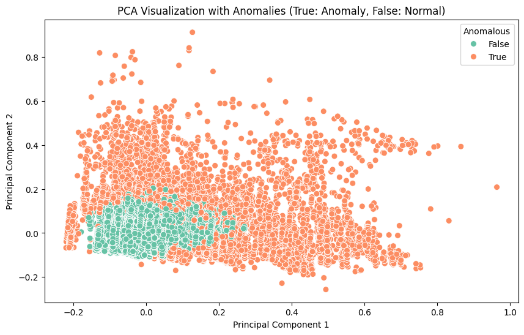
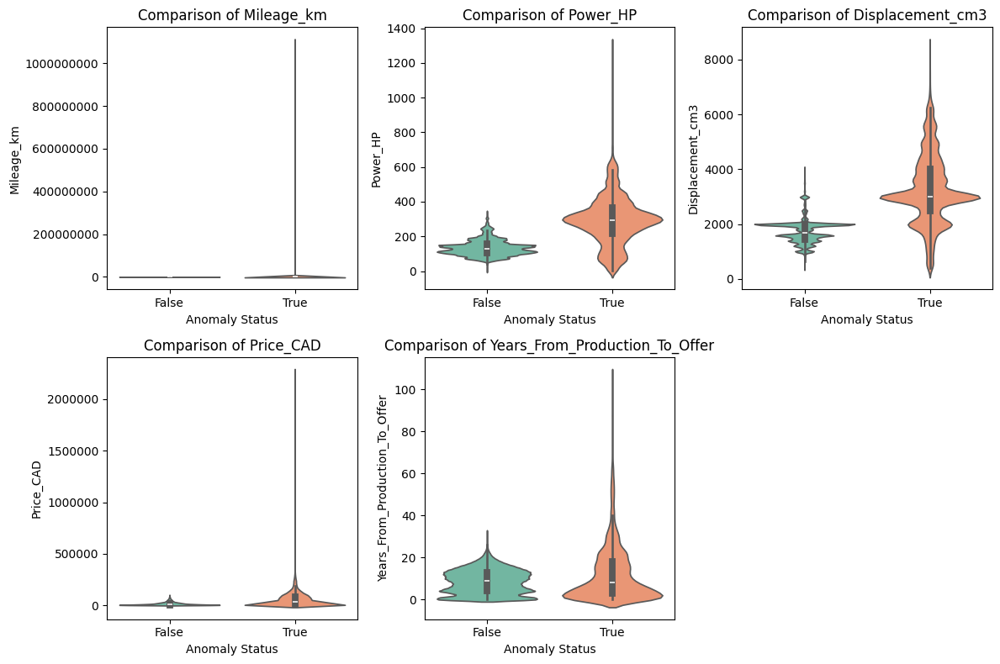
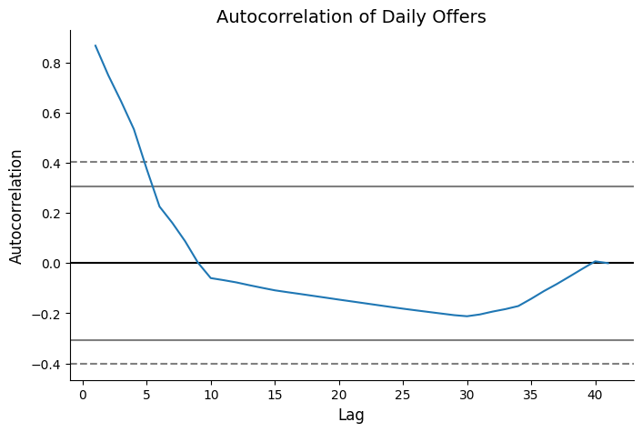
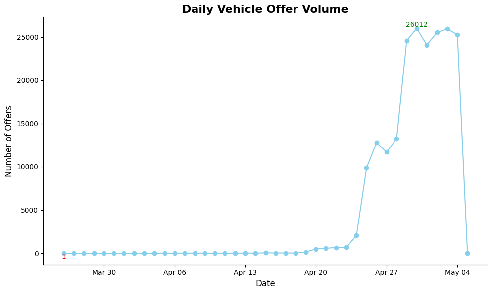

# Data-Driven Strategies for Insurance Fraud Prevention and Risk Assessment

## Introduction

According to the Insurance Bureau of Canada, insurance fraud costs Canadians well over $1 billion annually in added insurance premiums ([source](https://www.ibc.ca/news-insights/news/vigilance-is-key-in-fighting-insurance-fraud)). Addressing this challenge is critical, as reducing fraud not only lowers costs for insurers but also enhances customer satisfaction. To tackle this issue, I used the [Poland Cars for Sale dataset](https://www.kaggle.com/datasets/bartoszpieniak/poland-cars-for-sale-dataset) to perform vehicle segmentation, anomaly detection, and time series analysis. The overarching goal of this project is to provide actionable insights that can help insurers detect fraudulent activity, improve risk assessment, and enhance operational efficiency.

## Data Cleaning

A vast majority of the data cleaning process was dealing with null values. The dataset contains substantial null values in columns such as CO2 emissions, first owner (whether the vehicle has had one owner), vehicle version, vehicle generation, origin country, and car first registration day, as shown in **Figure 1**. Columns with null values in approximately half of the dataset were mostly dropped, except for "first owner." I noticed that vehicles not identified as having a single previous owner had null values in this column, so I filled them accordingly. For the remaining few null values, those observations were dropped as they were not substantial enough to lead to consequential information loss. Other preprocessing steps include creating a vehicle age column, standardizing currency, and converting the date columns to datetime format.

**Figure 1. Null Matrix Showing Distribution of Missing Data**

For insights from the exploratory data analysis step, refer to the [vehicle segmentation notebook](1.vehicle-segmentation.ipynb).

## Vehicle Segmentation

To streamline insurance fraud prevention efforts and improve risk assessment, K-Prototypes clustering was applied to segment vehicles into three distinct groups. The features selected for clustering—mileage, engine power (HP), engine size, price, vehicle age, and body type—were chosen based on insights gained from exploratory data analysis (EDA) and the business relevance of the features. The optimal number of clusters was determined using the Elbow Method and average Silhouette Scores, with three clusters offering the best balance between cluster cohesion and separation. K-Prototypes was specifically chosen for its ability to handle both categorical and numeric features, ensuring robust and interpretable segmentation despite the mixed data types.

The final clustering results yield an average silhouette score of 0.28, indicating that the samples within each cluster are relatively cohesive and farily separated from those in other clusters. As shown in Figure 2, there is clear separation between the clusters. The identified clusters offer nuanced groupings of vehicles, each with distinct characteristics, as shown in **Table 1** and **Figure 2**. 
- **Older City Commuters (Cluster 0)** are compact, older cars, predominantly city cars, with low engine power, high mileage, and affordability.
- **Modern Power Vehicles (Cluster 1)** include newer, higher-powered vehicles, mainly SUVs, with lower mileage and higher prices. 
- **Seasoned Family Travelers (Cluster 2)** consist of older, high-mileage vehicles, mostly station wagons, with larger engine sizes. 

Invaluable insights can be derived by analyzing historical data within each cluster to capture usage and claims patterns specific to each group. Insurers can leverage these insights to detect frivolous claims, enhance underwriting efficiency by addressing information asymmetry through cluster-specific risk profiles and claims patterns, and develop targeted marketing strategies tailored to the preferences and behaviors of each group. For example, **Older City Commuters** may prefer budget-friendly coverage options and  **Modern Power Vehicles** may require premium plans with comprehensive coverage and additional perks. Additionally, claims deviating significantly from a vehicle’s cluster trends (e.g., unusually frequent or expensive claims) can be flagged for scrutiny, while clusters with higher fraud incidence can be monitored more intensively. Integrating these cluster-based insights into insurance operations can mitigate financial risks, enhance underwriting precision, and improve customer experience.

### Cluster Centroids and Distribution

**Table 1. Centroids and Proportion of Identified Clusters**

| Cluster | Proportion (%) | Mileage (km) | Power (HP) | Engine Size (cm³) | Price (CAD) | Age (Years) | Type            |
|---------|----------------|--------------|------------|--------------------|-------------|-------------|-----------------|
| 0       | 37.32          | 150,000      | 95         | 1,402              | 7,173       | 10          | City Car        |
| 1       | 33.88          | 51,000       | 145        | 1,640              | 27,000      | 3           | SUV             |
| 2       | 28.80          | 223,000      | 146        | 1,981              | 8,097       | 12          | Station Wagon   |

### Cluster Visualization

**Figure 2. Visualization of Clusters**

*This plot is for visualization purposes only. While the two principal components that define the axes retain the variability in the data, thereby enabling visible cluster separation, no direct insights can be inferred solely from the plot.*

For more information on the methodology, thought process, results, business implications, threats to validity, and next steps, check the [vehicle_segmentation notebook](1.vehicle-segmentation.ipynb).

## Enhancing Vehicle Risk Assessment Through Anomaly Detection

One of the challenges in insurance is addressing information asymmetry, where customers often have more knowledge about their vehicles than insurers. Some customers may even withhold or misrepresent information. To mitigate the associated risks, insurers conduct thorough underwriting and risk assessments to set appropriate premiums. What if there was a way to automatically flag claims that deviate significantly from the norm? Anomaly detection provides such a solution. By identifying unusual patterns in vehicle features such as price, mileage, and age, insurers can more accurately assess vehicle risk profiles. For instance, a car with exceptionally low mileage for its age might indicate odometer tampering or extensive repairs due to prior accidents, both of which suggest elevated risk. Leveraging anomaly detection enables insurers to refine pricing models, offering customized premiums based on a vehicle’s true condition instead of relying solely on information provided by customers.

To build on this hypothesis, the 200,000 offers in the car ads dataset were analyzed using five different anomaly detection techniques focusing on the price, age, mileage, engine size, and power features. Since anomaly detection is an unsupervised learning problem, the evaluation of these techniques required a mix of intuition and quantitative measures such as the silhouette score and the Kolmogorov-Smirnov (KS) test. The silhouette score evaluates the cohesion and separation of clusters, treating anomalies and inliers as two distinct clusters. The KS test compares two samples to determine whether they come from the same distribution, with the null hypothesis being that they do. Based on these metrics and intuitive judgment, Isolation Forest was selected as the most effective technique. A contamination level of 10% was used, meaning 10% of the dataset was flagged anomalous. *See Figure 3 to visualize detected anomalies and Figure 4 to see a side-by-side comparison of anomalies and inliers for each feature.*

A comparison of anomalies and inliers revealed key patterns. For example, vehicle offers with implausible features, such as mileage exceeding 1.1 billion, were flagged as anomalies, as shown in Table 2. Similarly, vehicles priced as high as 2.2 million were also identified as outliers. Across all features, vehicles significantly deviating from market norms were detected, potentially including rare and luxury models or erroneous or fraudulent entries. However, some inliers may be misclassified as anomalies, which is a limitation of the Isolation Forest method, as it requires specifying a contamination level. Despite this, the findings confirm the potential for anomaly detection to streamline underwriting, refine risk profiling, and combat fraud, overinsurance, and underinsurance. 

**Figure 3. Visualization of Detected Anomalies**

*The detected anomalies account for 10% of all offers, amounting to just over 20,000 offers.*

**Table 2. Summary Table of Anomalous and Normal Vehicle Offers**

#### Anomalies
| Feature                        | Mean      | Std Dev   | Median   | Min   | Max          |
|--------------------------------|-----------|-----------|----------|-------|--------------|
| Mileage (km)                   | 204,455.95 | 7,945,569.33 | 91,000.00 | 1.00  | 1,111,111,111.00 |
| Power (HP)                     | 291.99     | 135.22    | 292.00   | 1.00  | 1,300.00     |
| Engine Size (Displacement_cm3) | 3,254.33   | 1,257.29  | 2,993.00 | 400.00| 8,400.00     |
| Price (CAD)                    | 55,512.87  | 65,629.16 | 32,165.00| 211.00| 2,273,975.00 |
| Age (Years)                    | 12.29      | 13.33     | 8.00     | 0.00  | 106.00       |

#### Inliers
| Feature                        | Mean      | Std Dev   | Median   | Min   | Max         |
|--------------------------------|-----------|-----------|----------|-------|-------------|
| Mileage (km)                   | 140,098.25| 93,314.31 | 149,035.00| 1.00  | 2,930,000.00|
| Power (HP)                     | 135.54    | 44.92     | 130.00   | 1.00  | 340.00      |
| Engine Size (Displacement_cm3) | 1,730.11  | 426.24    | 1,685.00 | 400.00| 4,015.00    |
| Price (CAD)                    | 16,105.11 | 15,277.50 | 10,689.00| 190.00| 100,426.00  |
| Age (Years)                    | 8.60      | 5.66      | 9.00     | 0.00  | 32.00       |

**Figure 4.Comparison of Anomalies and Inliers Distributions**

For more information on the methodology, feature selection, thought process , results, business implications, threats to validity, and next steps, check the [anomaly-detection notebook](2.anomaly-detection.ipynb).

## Leveraging Temporal Patterns in Vehicle Offers to Streamline Marketing Strategies

Effective marketing is crucial for the success of any insurance organization, but it can be costly. To optimize efforts and maximize ROI, a robust strategy is essential. In the digital age, where online advertisements dominate, insurance companies must position themselves strategically to raise awareness of their services. One promising approach is detecting temporal trends in car advertisement volumes, particularly on online platforms, to enhance the effectiveness of marketing campaigns.

A time-based analysis of the car advertisement data focused on offer publication dates, as this time based variable is more actionable for insurance companies compared to the other time-based variable, vehicle production year. Autocorrelation analysis shows a statistically significant positive autocorrelation in offer volumes for up to five days (lag 5), as illustrated in Figure 5. This indicates that the number of vehicle offers on a given day is strongly correlated with listing volumes from the preceding 5 days. Additionally, a notable surge in offer volumes was observed around April 25, as shown in Figure 6. This spike likely stems from external factors unrelated to trend or seasonality, but verifying if this is a seasonal pattern would require data spanning multiple years.

These findings present a strategic opportunity for marketing. Collaborating with advertisement platforms to time campaigns during periods of high listing activity, as predicted by trends from the previous five days, can improve ROI. Such an approach ensures that potential customers viewing vehicle listings are simultaneously exposed to tailored insurance offers. However, irregularities like the abrupt volume spike and the limited data range necessitate cautious interpretation of results. Further analysis on data that spans a longer time period is recommended to confirm the broader applicability of these trends.

**Figure 5. Autocorrelation Plot of Daily Offers**  

**Figure 6. Daily Offers Over Time**  

For more information on the methodology, feature selection, thought process , results, business implications, threats to validity, and next steps, check the [time-based-analysis notebook](3.time-based-analysis.ipynb).

