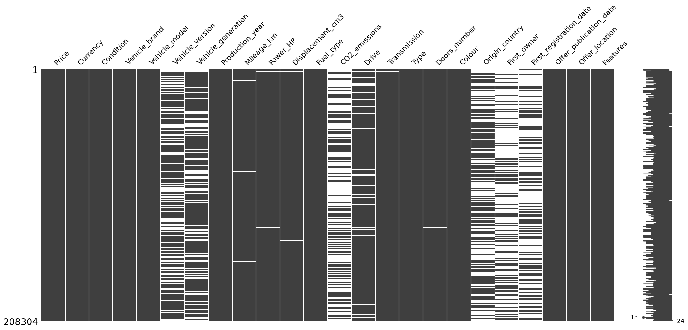

# Leveraging Vehicle ads Data for Fraud Prevention and Operational Efficiency 
## Introduction

According to the Insurance Bureau of Canada, insurance fraud costs Canadians well over $1 billion a year in added insurance premiums ([source](https://www.ibc.ca/news-insights/news/vigilance-is-key-in-fighting-insurance-fraud)). Preventing this fraud will not only reduce costs for Definity but also improve customer satisfaction. In this project, using the **Poland Cars for Sale** dataset ([link](https://www.kaggle.com/datasets/bartoszpieniak/poland-cars-for-sale-dataset)), I have performed vehicle segmentation, anomaly detection, and time series analysis with the goal of generating insights to enhance operational efficiency and prevent fraud for Definity.

Data cleaning and exploratory data analysis (EDA) were performed before performing the three main tasks. 

## Data Cleaning
A vast majority of the data cleaning process was dealing with null values. The dataset contains substantial null values in columns such as CO2 emissions, first owner (whether the vehicle has had one owner), vehicle version, vehicle generation, origin country, and car first registration day, as shown in the null matrix below:

For those columns that contained null values for about half of the dataset, the columns were dropped, except for "first owner," which was filled accordingly. I discerned that vehicles that are not first owners had null values, so I filled them accordingly. For the remaining few null values, those observations were dropped as they were not many and wouldn't lead to consequential information loss.

For EDA insights, visit the [vehicle_segmentation notebook](vehicle_segmentation.ipynb).

## Vehichle Segmentation

