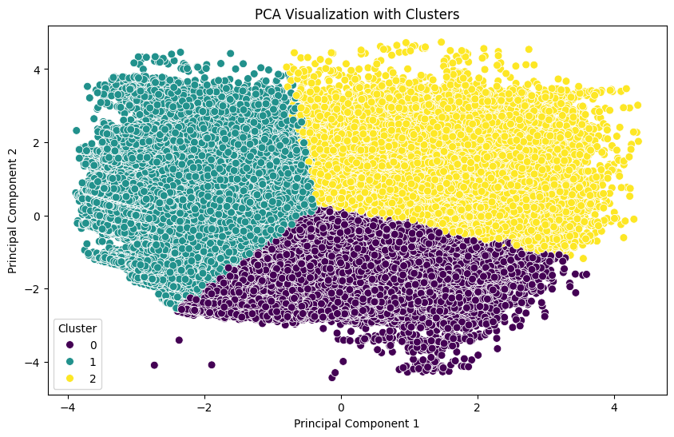

# Leveraging Vehicle Ads Data for Fraud Prevention and Operational Efficiency 

## Introduction

According to the Insurance Bureau of Canada, insurance fraud costs Canadians well over $1 billion a year in added insurance premiums ([source](https://www.ibc.ca/news-insights/news/vigilance-is-key-in-fighting-insurance-fraud)). Preventing this fraud will not only reduce costs for Definity but also improve customer satisfaction. In this project, using the [Poland Cars for Sale dataset](https://www.kaggle.com/datasets/bartoszpieniak/poland-cars-for-sale-dataset), I have performed vehicle segmentation, anomaly detection, and time series analysis with the goal of generating insights to enhance operational efficiency and streamline fraud prevention for Definity.

Data cleaning and exploratory data analysis (EDA) were performed before performing the three main tasks. 

## Data Cleaning

A vast majority of the data cleaning process was dealing with null values. The dataset contains substantial null values in columns such as CO2 emissions, first owner (whether the vehicle has had one owner), vehicle version, vehicle generation, origin country, and car first registration day, as shown in **Figure 1**.

**Figure 1. Null Matrix Showing Distribution of Missing Data**

For those columns that contained null values for about half of the dataset, the columns were dropped, except for "first owner," because I discerned that vehicles that are not first owners had null values, so I filled them accordingly. For the remaining few null values, those observations were dropped as they were not many and wouldn't lead to consequential information loss.

For insights from the exploratory data analysis, visit the [vehicle_segmentation notebook](vehicle_segmentation.ipynb).

## Vehicle Segmentation

To streamline Definity's fraud prevention efforts and improve risk assessment, K-Prototypes clustering was applied to segment vehicles into three distinct groups. The features selected for clustering—mileage, engine power (HP), engine size, price, vehicle age, and body type—were chosen based on insights gained from exploratory data analysis (EDA) and their practical relevance to the business context. The optimal number of clusters was determined using the Elbow Method and Silhouette Scores, with three clusters offering the best balance between cluster cohesion and separation. K-Prototypes was specifically chosen for its ability to handle both categorical and numeric features, ensuring robust and interpretable segmentation despite the mixed data types.

The identified clusters offer nuanced groupings of vehicles, each with distinct characteristics, as shown in **Table 1** and **Figure 2**. The **Older City Commuters (Cluster 0)** are compact, older cars with low engine power, high mileage, and affordability. The **Modern Power Vehicles (Cluster 1)** include newer, higher-powered vehicles with lower mileage and higher prices, while the **Seasoned Family Travelers (Cluster 2)** consist of older, high-mileage station wagons with larger engine sizes. Actionable insights can be derived by analyzing historical data within each cluster to capture usage and claims patterns specific to each group. Definity can leverage these insights to detect fraud-prone claims, enhance underwriting efficiency by addressing information asymmetry through cluster-specific risk profiles and claims patterns, and develop targeted marketing strategies tailored to the preferences and behaviors of each group. For example, **Older City Commuters** may prefer budget-friendly coverage options and  **Modern Power Vehicles** may require premium plans with comprehensive coverage and additional perks. Claims deviating significantly from a vehicle’s cluster trends (e.g., unusually frequent or expensive claims) can be flagged for scrutiny, while clusters with higher fraud incidence can be monitored more intensively.

### Cluster Centroids and Distribution

**Table 1. Centroids and Proportion of Identified Clusters**

| Cluster | Proportion (%) | Mileage (km) | Power (HP) | Engine Size (cm³) | Price (CAD) | Age (Years) | Type            |
|---------|----------------|--------------|------------|--------------------|-------------|-------------|-----------------|
| 0       | 37.32          | 150,000      | 95         | 1,402              | 7,173       | 10          | City Car        |
| 1       | 33.88          | 51,000       | 145        | 1,640              | 27,000      | 3           | SUV             |
| 2       | 28.80          | 223,000      | 146        | 1,981              | 8,097       | 12          | Station Wagon   |

### Cluster Visualization

**Figure 2. Cluster Visualization Based on Key Features**

Integrating these cluster insights into Definity's operations can mitigate financial risks, enhance underwriting precision, and improve customer retention. By offering tailored coverage options and focused marketing campaigns, Definity strengthens its market position while delivering exceptional customer experiences, which aligns with Definity's ambition to lead the industry in innovation, ensuring both operational efficiency and customer satisfaction.

For more information on the methodology, thought process, results, business implications, threats to validity, and next steps, check the [vehicle_segmentation notebook](vehicle_segmentation.ipynb).

